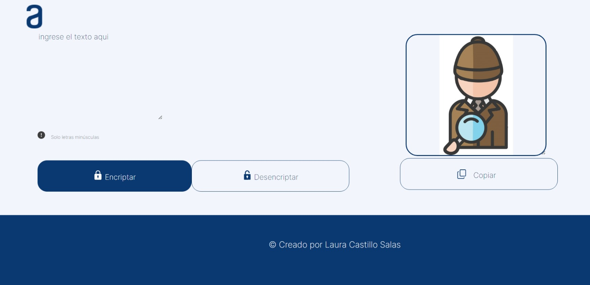

# ChallengeOne-Alura



## Table of Contents

- [Description](#description)
- [Installation](#installation)
- [Usage](#usage)
- [Contributing](#contributing)
- [Authors](#authors)
- [License](#license)

## Description

ChallengeOne-Alura is a web application developed as part of the Alura Challenges program. This project aims to provide a platform for users to explore and participate in coding challenges, improving their coding skills and knowledge.

## Installation

To run this project locally, follow these steps:

1. Clone the repository:

   ```bash
   git clone https://github.com/lcastillo24/ChallengeOne-alura.git


1. Install dependencies:
   npm install
2. Start the development server:
   npm start
3. Open your web browser and navigate to http://localhost:3000.

Usage
Browse through available coding challenges.
View challenge details, including descriptions, requirements, and deadlines.
Submit your solutions to challenges and track your progress.


Por supuesto, aquí tienes una versión revisada y mejorada del README.md para tu repositorio "ChallengeOne-alura":

markdown
Copy code
# ChallengeOne-Alura


## Table of Contents

- [Description](#description)
- [Installation](#installation)
- [Usage](#usage)
- [Contributing](#contributing)
- [Authors](#authors)
- [License](#license)

## Description

ChallengeOne-Alura is a web application developed as part of the Alura Challenges program. This project aims to provide a platform for users to explore and participate in coding challenges, improving their coding skills and knowledge.

## Installation

To run this project locally, follow these steps:

1. Clone the repository:

   ```bash
   git clone https://github.com/lcastillo24/ChallengeOne-alura.git
Install dependencies:


npm install
Start the development server:


npm start
Open your web browser and navigate to http://localhost:3000.

## Usage
Browse through available coding challenges.
View challenge details, including descriptions, requirements, and deadlines.
Submit your solutions to challenges and track your progress.

## Contributing
If you would like to contribute to this project, you can follow these steps:

Fork the repository.
Create a new branch (git checkout -b feature/new-feature).
Make your changes.
Commit your changes (git commit -am 'Add new feature').
Push to the branch (git push origin feature/new-feature).
Create a new Pull Request.
## Authors
Laura Castillo - GitHub

## License
This project is licensed under the MIT License - see the LICENSE file for details.
